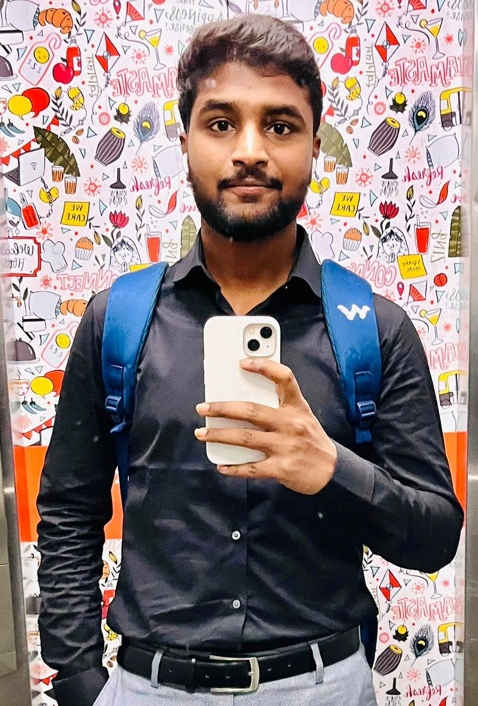

# Manush Kumar Kachakayala
I am from Nizamabad,Telangana and I have completed my Bachlores degree from Gokaraju Rangaraju institute of Engineering and Technlogy in the fied of Information Technology. I am very much intrested in coding and I hvae worked as Associate Software engineer and I have done couple of certification course. And I want develop in my career so, I have choosen masters my carreer advancement in the field of Applied Computer Science.




******

# Sports
 Sports like learning and working,help us develop a helthy mind and body. Additionally, it instills in us crucial virtues and life lessons thats mold our personalities and promote our mental and physical development. We learn to strategize, comfort obstacles head-on, and develop our critical thinking problem- sloving, and decisions-making skills through sports.All of this contributes to our mental and physical health, which is essiental for leading fullfilling lives.

|Sport Name |Reason|Hours|
|-----------|------|-----|
|Cricket| reduces body fat improves decesion making skills and also working stressful conditions.|2|
|Badminton| Develops quick reflexs, felxs our body and also team work will be developed.|2|
|Chess| This game deals with mental and problem solving skills|3|
|volly ball| It mainly depends team co ordinaton and it a stress buster for me.|2|

****
****

# Quotes
>“The more difficult the victory, the greater the happiness in winning.” – Pele

>“Champions keep playing until they get it right.” – Billie Jean King

>“Once you learn to quit, it becomes a habit.” – Vince Lombardi

****


## Coding Fencing

Link to PHP:
https://stackoverflow.com/questions/770876/how-do-i-add-gravatar-identicons-into-ruby-on-rails

PHP code:
``````
<?php
  $gravatar_link = 'http://www.gravatar.com/avatar/' . md5($comment_author_email) . '?s=32';
   echo '';
?>


